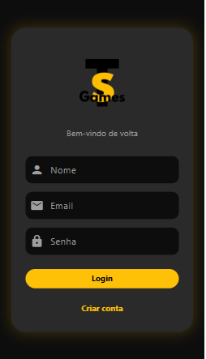
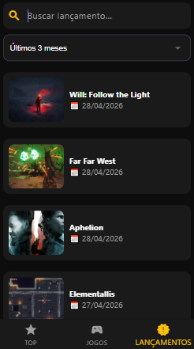

# 🎮 TS Games

Aplicação desenvolvida em Flutter com foco na exploração de jogos, consumo de API e experiência moderna para o usuário.

---

## 🚀 Tecnologias utilizadas

- Flutter
- Dart
- Firebase Authentication
- HTTP (API REST)
- Shared Preferences
- RAWG API

---

## 🌐 Funcionalidades

- 🔐 Cadastro e login de usuários
- 👤 Perfil com nome e email
- 🎮 Listagem de jogos populares
- 🔎 Detalhes completos dos jogos
- ⭐ Último jogo visualizado
- 📱 Interface moderna e intuitiva

---

## 🔗 API utilizada

https://rawg.io/apidocs

---

## 📦 Download do APK

👉 Baixe o aplicativo:

🔗 https://drive.google.com/file/d/1L-BdifrzPQfI32iUfWGRq3uijnwfg20n/view?usp=sharing

---

## 📸 Screenshots

### 🔐 Login


### 🏠 Home


### 🎮 Jogos


### 🔎 Detalhes


### 🚀 Lançamentos


---

## 🏗 Arquitetura da aplicação

App Flutter  
↓  
Consome dados da RAWG API  
↓  
Autenticação com Firebase  
↓  
Armazena dados localmente  

---

## 👨‍💻 Autor

João Vitor  
Estudante de Engenharia de Software (5º semestre) — UNI-FACEF  

---

## ⚙️ Como rodar o projeto

```bash
git clone https://github.com/JoaoVSCarvalho1/TS_Games.git
cd TS_Games
flutter pub get
flutter run
